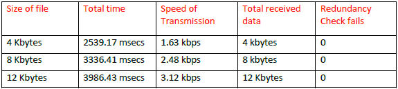

# UDP file transfer
> It measures performance udp file transmission with CRC.

### Used Technologies

C++, Visual Studio  

## Description

From Glenn Fiedler’s code, we utilized the reliable UDP which controls the missing packets and transmission speed control, however it didn’t have the algorithm to check whether the received data is complete or not. Main purpose of this assignment is to add the algorithm which checks and ensures the integrity of a file through the transmit/receive loop.

To complete this assignment, the client application adds the CRC algorithm to verify packets sent to the server. The server unpacks the CRC code and runs the CRC algorithm with received data to compare the sent and received CRC values. If the local CRC value is different with the received CRC value, the server drops the packet on our layer, and re-sends that packet utilizing Glenn Fiedler’s algorithm.

## Testing Method

We tested our application between two remote desktops in 2A213 lab (also desktops and laptop in 2A213) inside Conestoga College Doon campus. We sent different size text or word files among them.

Tools’ specification:
	* Desktop: Intel Core i5-4590 CPU (3.30GHz), 8 GB RAM, Windows 7 (64bit)
	* Laptop: Surface Pro 3 i5-4300 (2.9GHz), 8 GB RAM, Windows 10 (64bit)

## Results

The overhead created by Glen Fiedler’s code and our own code is significant and is noticeable compared to our assignment 01 results which did not verify or check file integrity. Over 1MB files appear to take too much time.



## Test procedure

When we run the client side, it creates packets out of the file selected and adds our own header which includes a “order value”, “file size value”, “the actual data”, and the “crc” value of the complete data including our header. The server receives the packets and dismantles the header accordingly and re-checks the CRC value. If incomplete data is detected based on the CRC values not matching the server drops that packet and asks to re-send the packet.
Fiedler’s algorithm didn’t take care of the redundancy of data. To finish the transmission, the server sends back the acknowelegement packet to the client when the server gets the last packet and waits for 20 packets to make sure it didn’t just miss data and that the transmission is complete.

## Comparison to windows explorer

The transmission time with windows explorer is much faster than our complete code at transmitting files.

## References

* Easy-Tutorials.net. (2015, 12 28). A MULTITHREADED SERVER IN C++. Retrieved from Easy-Tutorials.net: http://easy-tutorials.net/c/multithreaded-socket-server-cpp/

* Fiedler, G. (n.d.). Reliability, Ordering and Congestion Avoidance over UDP. Retrieved from GAFFER ON GAMES: http://gafferongames.com/networking-for-game-programmers/reliability-and-flow-control/

* Koopman, P. (2012, 5 9). Tutorial: Checksum and CRC Data Integrity. Retrieved from https://users.ece.cmu.edu/~koopman/pubs/KoopmanCRCWebinar9May2012.pdf

* Microsoft. (2014, 6 13). The OSI Model's Seven Layers Defined and Functions Explained. Retrieved from Mcrosoft: https://support.microsoft.com/en-us/kb/103884

* Nelson, M. (1992, 5 1). File Verification Using CRC. Retrieved from Mark NelsonProgramming, mostly.: http://marknelson.us/1992/05/01/file-verification-using-crc-2/

## Screen Shot

## Installation

Windows:

```sh

```

## Usage example

## Development setup